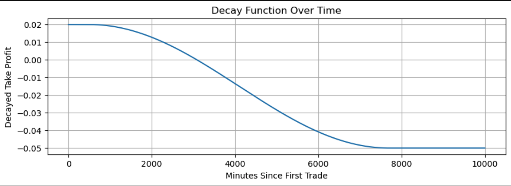
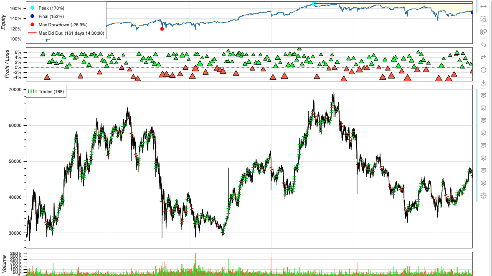
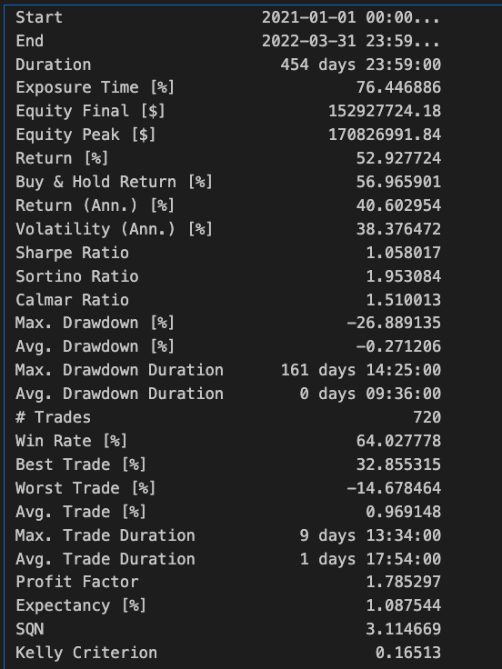

# Working with backtesting.py library

I put this together to identify if there were programmatic rules we could put in place in order to exit losing positions with a minimum amount of pain, and even a potential profit. The file [backtesting_with_vbt.ipynb](backtestin_with_vbt.ipynb) is a long only version of such a strategy. As a simple test, I created an arbitrary entry every day at the first minute of the day. The strategy then had to either take a quick profit if avaialable or work it's way out of the hole by adding to the position. I added a decay function to it as well so you could start with a target take profit level, but as the trade wore on, the profit target would decay until finally reaching an acceptable loss. 

## Here is an example of a backtest.

These are not optimized at all 

### And here is the stats df

